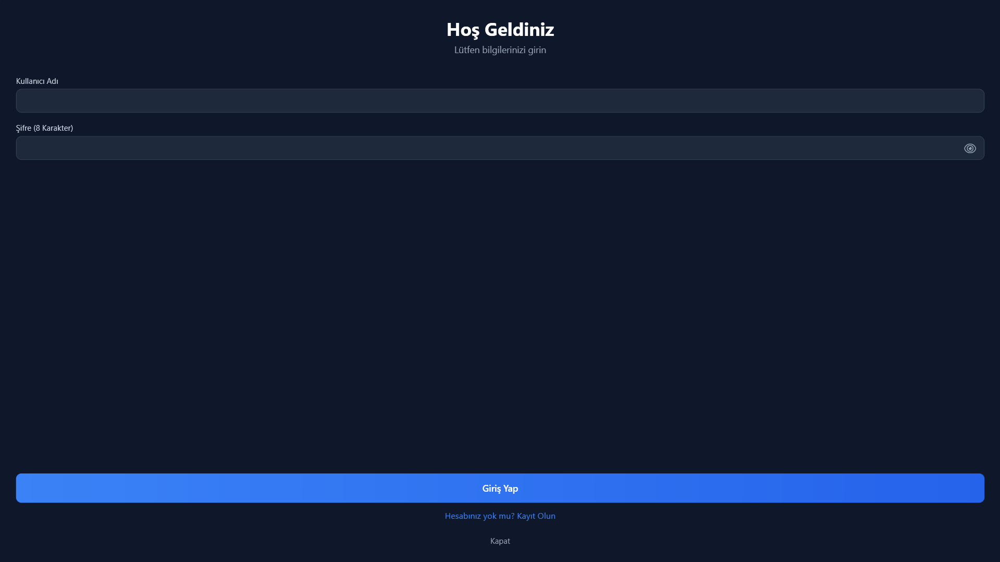
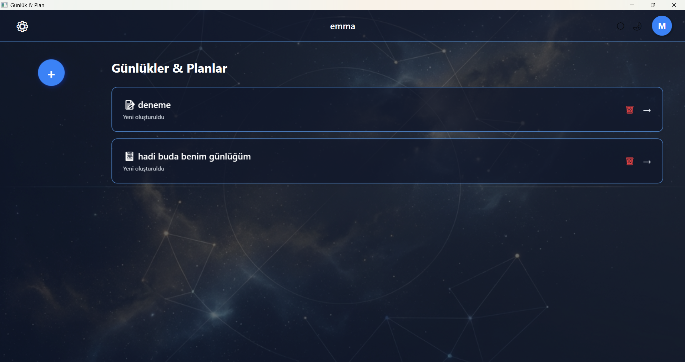

# 📔 Notes & Diary

A personal journal and task planner desktop application built with **WPF (.NET 8)** and **SQLite**.

---

## Screenshots


| Login | Home |
|-------|------|
|  |  |

---

## Features

- **Multi-user support** — register and log in with separate accounts
- **Persistent sessions** — stay logged in until you manually sign out
- **Journals** — create personal diary entries, navigate day by day
- **Plan pages** — add tasks with three states: pending, half-done, completed
- **Themes** — light ☀️ and dark 🌙 mode per journal
- **Custom backgrounds** — set a personal background image
- **Profile photo** — upload a profile picture per account
- **Secure passwords** — stored as SHA-256 hashes

---

## Tech Stack

| | |
|---|---|
| Language | C# |
| Framework | .NET 8 / WPF |
| Database | SQLite (`Microsoft.Data.Sqlite`) |
| Platform | Windows |

---

## Getting Started

### Requirements
- Windows 10/11
- [.NET 8 SDK](https://dotnet.microsoft.com/download/dotnet/8.0)

### Run

```bash
git clone https://github.com/MustafaBite/Notes-Diary.git
cd Notes-Diary
dotnet run --project NOT_VE_GÜNLÜK.csproj
```

The database (`NotVeGunluk.db`) is created automatically on first launch inside `bin/Debug/net8.0-windows/`.

---

## Project Structure

```
├── App.xaml / App.xaml.cs         # Startup, session check
├── LoginWindow                    # Login & register
├── HomePage                       # Journal list
├── JournalPage                    # Daily diary entries
├── PlanPage                       # Task planner
├── JournalSettingsPage            # Per-journal settings
├── ProfileSettingsDialog          # Profile photo & background
├── DataService.cs                 # All database logic (SQLite)
└── .gitignore                     # Excludes bin/, obj/, *.db
```
